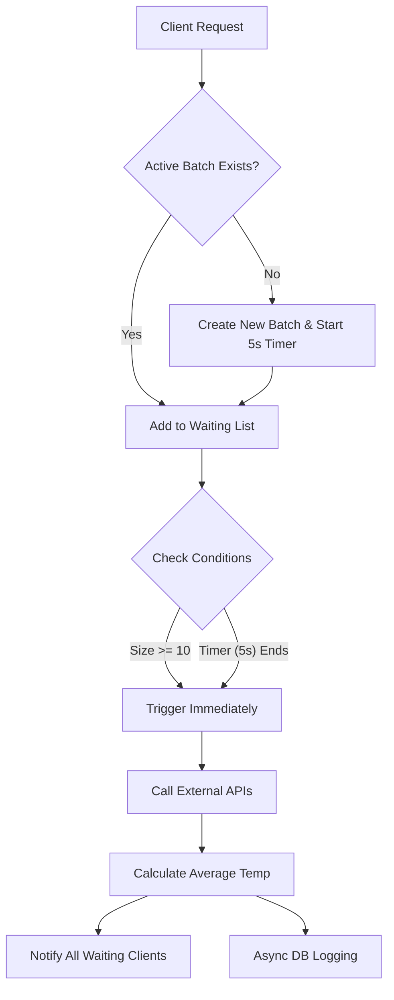

# 🌤️ Weather Aggregation Service

A high-performance, resilient weather query service built with **Spring Boot 3**. This project implements the **Aggregator Pattern** to optimize external API usage by batching incoming requests.

  

## Overview

This service acts as a middleware between clients and expensive external weather providers (WeatherAPI & WeatherStack). Instead of forwarding every request immediately, it groups user requests based on location and time windows.

**The Goal:** Minimize external API calls while keeping latency acceptable.

## Key Features

* **Request Aggregation (Batching):** Incoming requests for the same location are queued and processed in batches to minimize external API calls.
    * *Limit Rule:* Batches are processed immediately when **10 requests** accumulate.
    * *Timeout Rule:* Batches are processed automatically after **5 seconds** if the limit is not reached.
* **Concurrency:** Built with `CompletableFuture` and `ConcurrentHashMap` for non-blocking, asynchronous processing.
* **Resilience:** Integrated **Circuit Breaker** patterns to handle external service failures gracefully.
* **Observability:** Full monitoring stack with **Prometheus** and **Grafana**.
* **Simulation API:** Built-in load testing endpoint to verify batch logic.

## Architecture

The system uses an in-memory buffer to hold requests. Below is the logic flow for a single location (e.g., "Istanbul"):


## Tech Stack

* **Core:** Java 17, Spring Boot 3, Spring Web
* **Data:** SQLite, Spring Data JPA (Hibernate)
* **Concurrency:** Java Util Concurrent (CompletableFuture, ConcurrentHashMap)
* **Resilience:** Resilience4j (Circuit Breaker, Retry)
* **DevOps:** Docker, Docker Compose
* **Monitoring:** Spring Actuator, Prometheus, Grafana

## API Reference

| Method | Endpoint | Description |
| :--- | :--- | :--- |
| `GET` | `/api/v1/weather?q={city}` | Get aggregated weather data. |
| `GET` | `/api/v1/query-logs` | View history of batched requests. |
| `POST` | `/api/v1/simulation/load-test` | Simulates concurrent requests to verify batch aggregation logic. |


## How to Run

1.  **Clone the repository:**
    ```bash
    git clone https://github.com/minelsaygisever/weather-query-service.git
    cd weather-query-service
    ```

2.  **Set up Environment Variables:**
    Create a file named `.env` in the root directory. This file will hold your sensitive configuration. You will need to obtain free API keys from the following providers:

    * [Get WeatherAPI Key](https://www.weatherapi.com/)
    * [Get WeatherStack Key](https://weatherstack.com/)
    
    **File:** `.env`
    ```env
    # WeatherAPI.com Configuration
    WEATHER_API_KEY=[your_weatherapi_key_here]
    WEATHER_API_URL=http://api.weatherapi.com/v1/forecast.json

    # Weatherstack.com Configuration
    WEATHERSTACK_KEY=[your_weatherstack_key_here]
    WEATHERSTACK_URL=http://api.weatherstack.com/current
    ```
3.  **Start with Docker Compose:**
    ```bash
    docker-compose up -d --build
    ```

4.  **Access the Services:**
    * **Application API:** `http://localhost:8080`
    * **Swagger UI:** `http://localhost:8080/swagger-ui.html`
    * **Grafana Dashboard:** `http://localhost:3000` (Login: `admin` / `admin`)
    * **Prometheus:** `http://localhost:9090`

## Verification Strategy

To verify the aggregation logic manually:
1. **Open Logs:** docker logs -f weather-service
2. **Trigger Simulation:** Send 50 requests.
    ```bash
    curl -X POST "http://localhost:8080/api/v1/simulation/load-test?city=London&requestCount=50"
    ```
3. **Expectation:** You should see 5 batches of 10 requests being processed in the logs immediately.